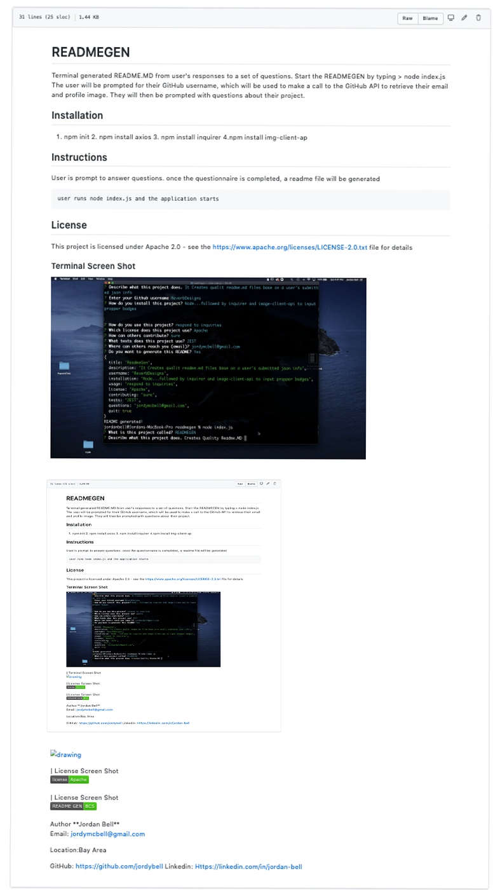

# READMEGEN [License](https://img.shields.io/badge/license-Apache-success) !(https://img.shields.io/badge/README%20GEN-BCS-brightgreen)
Terminal generated README.MD from user's responses to a set of questions. Start the READMEGEN by typing > node index.js  <br>The user will be prompted for their GitHub username, which will be used to make a call to the GitHub API to retrieve their email and profile image. They will then be prompted with questions about their project.</p>

## Installation
1. npm init  2. npm install axios  3. npm install inquirer 4.npm install img-client-ap
## Instructions
User is prompt to answer questions. once the questionnaire is completed, a readme file will be generated
```
user runs node index.js and the application starts
```
## License 
This project is licensed under Apache 2.0 - see the https://www.apache.org/licenses/LICENSE-2.0.txt file for details
### Terminal Screen Shot

### Terminal Screen Shot

### Author

**Jordan Bell**

Email: jordymcbell@gmail.com

Location:Bay Area

GitHub: https://github.com/jordybell
Linkedin: Https://linkedin.com/in/jordan-bell
